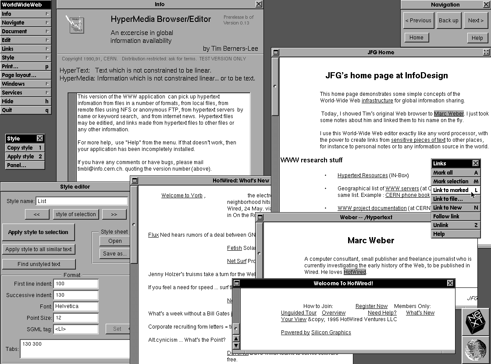

# 1991-WWW-NeXT

Source code of WorldWideWeb, the first web browser and HTML editor in history, written by Tim Berners-Lee in Objective-C on the NeXT workstation.

The software was [released into public domain](https://cds.cern.ch/record/1164399) in 1993 by CERN. Archived from a [page on w3.org](https://www.w3.org/History/1991-WWW-NeXT/) which has no links to the files. Additional HTML files from its parent directory have been moved to the `hypertext` folder.
